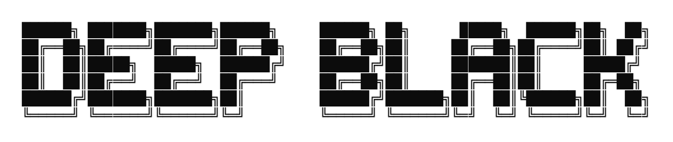
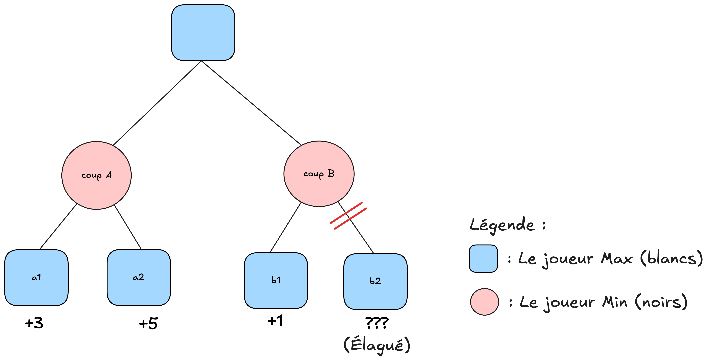
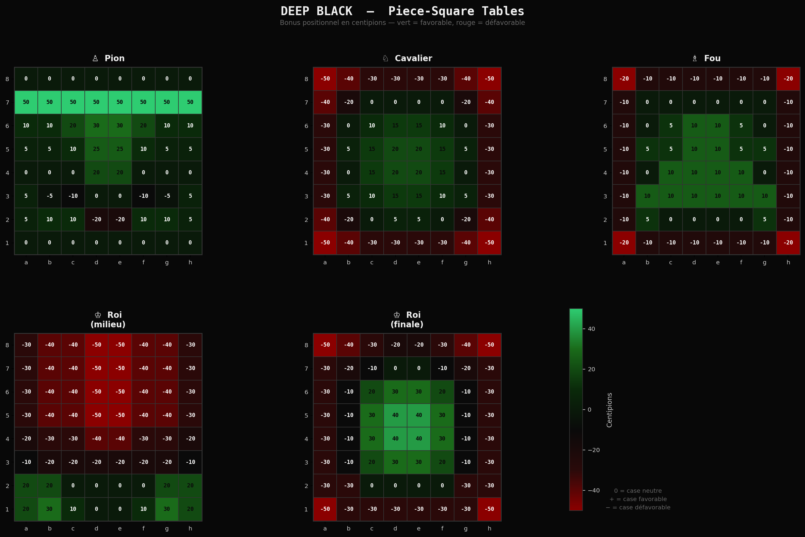

<div align="center">



**Moteur d'échecs Java 17** — Intelligence Artificielle — Université Paris Cité — 2025/2026

Réalisé par **HAMIA Abderahmane Nazim** et **FERHANI Ales Amazigh**

</div>

---

## Présentation

DEEP BLACK est un moteur d'échecs complet écrit en Java 17. Il repose sur une représentation bitboard du plateau, un algorithme Minimax avec élagage Alpha-Bêta, une table de transposition Zobrist de 4 millions d'entrées, une recherche de quiescence, un livre d'ouvertures binaire construit depuis des parties PGN de référence, et une interface graphique JavaFX. Trois niveaux de difficulté sont disponibles, chacun disposant de sa propre fonction d'évaluation et de ses propres paramètres de recherche.

Au niveau Difficile, le moteur atteint une profondeur de 8 à 14 demi-coups selon la phase de jeu, et tient tête à des bots évalués à 2400 Elo sur chess.com pendant une grande partie de la partie.

---

## Architecture

| Package | Rôle |
|---|---|
| `fr.moteurechecs.plateau` | Représentation bitboard, génération de coups, règles du jeu |
| `fr.moteurechecs.ia` | Orchestration IA, recherche IDS Alpha-Bêta, finales techniques |
| `fr.moteurechecs.ia.evaluation` | Matériel, mobilité, PST, sécurité du roi, structure des pions |
| `fr.moteurechecs.ia.recherche` | Récursion Alpha-Bêta, quiescence, table de transposition, tri MVV-LVA |
| `fr.moteurechecs.ouverture` | Livre d'ouvertures binaire, parseur PGN, clé de position Zobrist |
| `fr.moteurechecs.jeu` | Boucle de jeu console, abstraction joueurs |
| `fr.moteurechecs.tournoi` | Tournoi automatique, sauvegarde incrémentale, rapport de résultats |
| `fr.moteurechecs.gui` | Interface JavaFX, échiquier interactif, contrôleur MVC, notation SAN |

---

## Prérequis

| Outil | Version |
|---|---|
| Java (JDK) | 17 ou supérieur |

---

## Lancement

Le projet est livré avec un JAR autonome incluant toutes les dépendances. Il suffit de le lancer directement :

```bash
java -jar target/chess-engine-1.0-SNAPSHOT.jar
```

Pour recompiler et reconstruire le JAR depuis les sources (nécessite Maven 3.6+) :

```bash
mvn clean package
java -jar target/chess-engine-1.0-SNAPSHOT.jar
```

---

## Algorithme de recherche

Le moteur explore l'arbre des coups possibles avec l'algorithme **Minimax** : les Blancs cherchent à maximiser le score, les Noirs à le minimiser. Sans optimisation, l'espace de recherche aux échecs dépasse 10^120 positions, ce qui rend toute exploration exhaustive impossible.

**L'élagage Alpha-Bêta** réduit drastiquement le nombre de noeuds explorés en abandonnant les branches qui ne peuvent pas influencer la décision finale.



Dans cet exemple, les Blancs jouent en premier et veulent maximiser. Le coup A mène à un score garanti de +3 (les Noirs, qui minimisent, choisiront A1 = +3 plutôt que A2 = +5). Quand on explore le coup B, la première réponse B1 donne +1. Les Noirs savent qu'ils peuvent limiter B à +1 au maximum. Mais les Blancs ont déjà +3 garanti via A. Ils ne choisiront jamais B. La branche B2 ne sera donc jamais évaluée : c'est la coupure bêta. En pratique, Alpha-Bêta réduit la complexité de 10^9 à environ 10^5 noeuds pour la même profondeur.

Sur ce mécanisme de base, DEEP BLACK ajoute plusieurs optimisations.

**Iterative Deepening (IDS)** : la recherche commence à profondeur 1 et s'approfondit progressivement. Si le temps alloué expire, le meilleur coup de la profondeur précédente est joué. Aucun coup ne reste sans réponse.

**Tri des coups (MVV-LVA)** : les captures sont triées avant l'exploration. Examiner en premier les captures d'une dame par un pion génère beaucoup plus de coupures qu'explorer dans un ordre aléatoire. Ce tri peut doubler l'efficacité de l'élagage.

**Table de transposition Zobrist** : les positions déjà analysées sont mémorisées dans une table de 4 millions d'entrées indexées par un hachage 64 bits. Quand une même position est atteinte par des chemins différents, le résultat mémorisé est réutilisé immédiatement sans recalcul.

**Fenêtres d'aspiration** : au lieu de chercher dans la fenêtre complète, la recherche commence dans une fenêtre étroite autour du score de la profondeur précédente (plus ou moins 50 centipions). Si la valeur réelle en sort, on relance avec une fenêtre élargie. Cela génère plus de coupures sur les profondeurs élevées.

**Recherche de quiescence** : à la profondeur limite, si des captures sont encore possibles, la recherche continue sur les captures uniquement jusqu'à atteindre une position calme. Cela évite l'effet horizon, c'est-à-dire évaluer une position juste avant une capture de dame comme si elle était stable.

---

## Niveaux de difficulté

| Niveau | Profondeur | Alpha-Bêta | Tri coups | Livre | Table TT | Fonction d'évaluation |
|---|---|---|---|---|---|---|
| FACILE | 3 | Non | Non | Non | Non | Matériel + développement + centre |
| MOYEN | 5 | Oui | Oui | Non | Non | Matériel + mobilité + structure pions |
| DIFFICILE | 8 à 14 | Oui | Oui | Oui | Oui | Matériel + PST + mobilité + sécurité roi + interpolation de phase |

Le niveau FACILE n'utilise pas d'élagage, ce qui le rend délibérément plus lent et moins fort. Le niveau DIFFICILE adapte sa profondeur selon la phase de jeu : 10 demi-coups en ouverture, 8 en milieu de jeu, 14 en finale.

---

## Évaluation heuristique

La fonction d'évaluation du niveau DIFFICILE combine plusieurs termes, pondérés par un facteur de phase calculé depuis le matériel restant sur le plateau.

**Matériel** : pion = 100 cp, cavalier = 320 cp, fou = 330 cp, tour = 500 cp, dame = 900 cp.

**Piece-Square Tables (PST)** : chaque pièce reçoit un bonus ou une pénalité selon sa position sur l'échiquier. Un cavalier au centre vaut plus qu'un cavalier en coin. Le roi a deux tables distinctes, une pour le milieu de jeu (sécurité, pénalisé au centre) et une pour la finale (centralisation, doit être actif). Le score est une interpolation linéaire entre les deux selon la phase.



**Mobilité** : +2 centipions par coup légal disponible. Une pièce qui contrôle plus de cases est plus active.

**Sécurité du roi** : malus progressif proportionnel au nombre de cases adjacentes au roi attaquées par l'adversaire. En milieu de jeu, un roi exposé est sévèrement pénalisé.

**Structure des pions** : bonus proportionnel à l'avancée de chaque pion vers la promotion, utilisé principalement en finale.

**Coincement** : quand l'avantage matériel dépasse une dame (900 cp), un bonus récompense le rapprochement du roi adverse vers les bords et la proximité des deux rois, pour guider la conversion des finales techniquement gagnantes.

---

## Livre d'ouvertures

Le livre est construit hors ligne depuis un fichier PGN via `ConstructeurLivreOuvertures`. Pour chaque position rencontrée, les coups sont comptés et les 6 plus fréquents sont conservés. Le résultat est sérialisé dans un fichier binaire `data/openings.book`, ce qui permet un accès en O(1) par hachage de position pendant la partie. Avant de jouer un coup du livre, un contrôle de sécurité vérifie l'absence de chute matérielle immédiate. Le livre est actif jusqu'au 20ème demi-coup.

---

## Finales techniques

Quand le plateau ne contient que le roi et des pièces lourdes d'un côté contre un roi seul, `Finale.java` prend la main avec des heuristiques spécialisées pour trois configurations : Roi + Dame vs Roi (KQK), Roi + Tour vs Roi (KRK), et Roi + 2 Tours vs Roi (KRRK). La logique privilégie le coincement du roi adverse vers les bords, la réduction de sa mobilité, et l'évitement du pat.

---

## Documentation technique

La documentation complète de chaque classe, interface et énumération est consultable en ligne ou localement.

**[Ouvrir la documentation](https://deepblack.nazimhamia.fr)**

Ou ouvrez le fichier `javadoc/index.html` directement dans votre navigateur.

Le site documente pour chaque classe sa déclaration Java, sa description fonctionnelle, ses champs et méthodes publics, ainsi que ses dépendances internes. Un champ de recherche permet de filtrer les classes en temps réel.

---

## Arborescence du projet

```
chess-engine/
    src/main/java/fr/moteurechecs/
        plateau/            Représentation bitboard, génération et validation des coups légaux
        ia/                 Orchestration de l'IA, finales techniques, point d'entrée de la recherche
        ia/evaluation/      Fonctions d'évaluation heuristique (matériel, PST, mobilité, roi, pions)
        ia/recherche/       Récursion Alpha-Bêta, quiescence, table de transposition, tri MVV-LVA
        ouverture/          Livre d'ouvertures binaire, parseur PGN, hachage Zobrist
        jeu/                Boucle de jeu en mode console, abstraction des joueurs
        tournoi/            Moteur de tournoi automatique, sauvegarde et rapport de résultats
        gui/                Interface graphique JavaFX, échiquier interactif, contrôleur MVC
        Main.java           Point d'entrée principal de l'application
    src/main/resources/     Sprites PNG des pièces utilisés par l'interface graphique
    data/                   Livre d'ouvertures sérialisé (openings.book) chargé au démarrage
    javadoc/                Documentation HTML complète de toutes les classes et interfaces
    assets/                 Visuels illustratifs utilisés dans ce README
    pom.xml                 Configuration Maven, dépendances JavaFX et plugin de packaging
    README.md               Présentation du projet, algorithmes et instructions de lancement
    HAMIA_FERHANI.pdf       Rapport écrit remis dans le cadre de l'évaluation
    lichess.pgn             Parties PGN de référence ayant servi à construire le livre d'ouvertures
```
